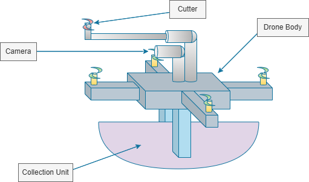
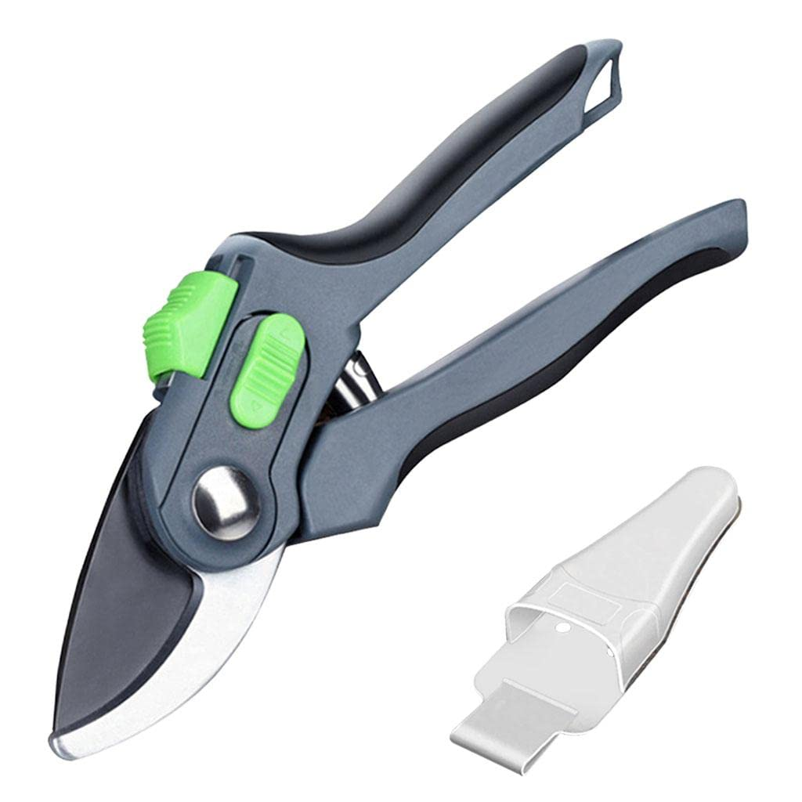
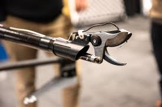

## 📐 Hardware Architecture & Mechanical Design

The physical platform is split into two primary design domains: the aerial carrier structure and the automated mechatronic end-effector.

### 1. Conceptual System Layout
Below is the initial structural blueprint detailing the spatial arrangement of the perception payload, actuation arm, and primary collection unit.

* **Design Integration:** The camera is co-located along the central axis of the robotic manipulation arm to maintain visual-servoing alignment loops.
* **Payload Management:** The underslung collection unit is dynamically centered to prevent sudden shifts in the Center of Gravity (CoG) during flight operations.

---

### 2. End-Effector Mechanism & Actuation Reference
To handle stem shearing without introducing high torque loads to the drone chassis, the system evaluates an under-actuated mechanical cutter assembly inspired by bypass pruning configurations.

| Reference Concept | Embedded Actuation Blueprint |
| :---: | :---: |
|  |  |
| **Fig A:** Bypass shear blade geometry used for low-friction cutting profiles. | **Fig B:** Prototype reference of a motorized link mechanism executing closed-loop cutting strokes. |
